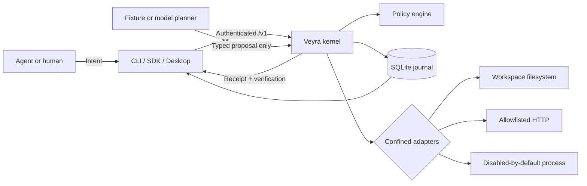

# Veyra

[](https://github.com/Ontixa/veyra/actions/workflows/ci.yml)
[](https://github.com/Ontixa/veyra/actions/workflows/codeql.yml)
[](https://scorecard.dev/viewer/?uri=github.com/Ontixa/veyra)

**Reversible execution for AI agents.**

Veyra is a local, embeddable execution kernel placed between an AI agent and side-effecting tools.
The model proposes typed effects; Veyra checks exact authority, shows what will change, binds human
approval to that content, executes through confined adapters, verifies postconditions, and records
enough evidence to roll back or recover safely.

It is deliberately not an agent framework, a prompt library, or a general shell wrapper. Existing
MCP clients, A2A agents, and orchestration frameworks can use Veyra as their trusted execution
boundary.

## Why this exists

Giving a model a powerful tool and asking it to behave is not an authorization system. Prompt
injection, retries, stale approvals, ambiguous resource scopes, and partial failures all happen
outside the model's ability to police itself. Veyra turns each side effect into a versioned
transaction with independently enforced invariants:

1. An untrusted planner proposes a typed `Plan` inside the intent's resource envelope.
2. Deny-by-default policy checks live, expiring, principal-bound capabilities before adapters may
   observe a target.
3. Authorized adapters preflight effects without mutation; policy then reevaluates the exact
   structured preview.
4. Required approval covers the canonical digest of the exact preflighted effect.
5. Execution uses idempotency reservations, bounded adapters, and an append-only journal.
6. The kernel verifies declared postconditions before committing.
7. Supported effects can be rolled back; compensation and irreversibility remain explicit.

## Architecture



The trusted Rust boundary is split by responsibility: `veyra-core` owns orchestration and state,
`veyra-policy` owns authority decisions, `veyra-journal` owns persistence and recovery evidence,
`veyra-executor` owns operating-system interaction, and `veyra-protocol` owns versioned wire types.
The server, CLI, TypeScript SDK, and Tauri application are clients of that boundary.

## Quick start

### Download a verified release

The CLI/daemon archives do not require Rust, Node.js or pnpm. The commands below
use GitHub CLI (`gh`) for downloads and provenance verification, plus your
platform's extraction and checksum tools. Use a new download directory and stop
if any verification fails; do not execute an unverified artifact.

The [v0.1.0 release](https://github.com/Ontixa/veyra/releases/tag/v0.1.0) provides Linux and Windows
CLI/daemon archives plus an unsigned Windows desktop installer. Each binary artifact has a SHA-256
checksum and a GitHub build-provenance attestation; the release also includes a Syft-generated,
attested SPDX 2.3 repository dependency snapshot and an attested release manifest binding asset
digests to the source-tag and release-control commits.

Linux x86-64, in Bash:

```sh
set -eu
mkdir veyra-v0.1.0
cd veyra-v0.1.0
gh release download v0.1.0 --repo Ontixa/veyra \
  --pattern 'veyra-linux-x86_64.tar.gz*' \
  --pattern 'veyra-v0.1.0.release-manifest.json*'
sha256sum --check veyra-linux-x86_64.tar.gz.sha256
sha256sum --check veyra-v0.1.0.release-manifest.json.sha256
gh attestation verify ./veyra-linux-x86_64.tar.gz --owner tang-vu \
  --signer-workflow tang-vu/veyra/.github/workflows/release.yml
gh attestation verify ./veyra-v0.1.0.release-manifest.json --owner tang-vu \
  --signer-workflow tang-vu/veyra/.github/workflows/release.yml
tar -xzf veyra-linux-x86_64.tar.gz
./veyra-linux-x86_64/veyra demo --json
```

Windows x86-64, in PowerShell:

```powershell
$ErrorActionPreference = "Stop"
New-Item -ItemType Directory -Path veyra-v0.1.0 | Out-Null
Set-Location veyra-v0.1.0
gh release download v0.1.0 --repo Ontixa/veyra `
  --pattern 'veyra-windows-x86_64.zip*' `
  --pattern 'veyra-v0.1.0.release-manifest.json*'
if ($LASTEXITCODE -ne 0) { throw "Release download failed" }
foreach ($file in @("veyra-windows-x86_64.zip", "veyra-v0.1.0.release-manifest.json")) {
  $expected = ((Get-Content -LiteralPath "$file.sha256" -Raw).Trim() -split '\s+')[0]
  $actual = (Get-FileHash -LiteralPath $file -Algorithm SHA256).Hash
  if ($expected -notmatch '^[0-9a-fA-F]{64}$' -or $actual -ne $expected) {
    throw "Checksum mismatch: $file"
  }
  gh attestation verify $file --owner tang-vu `
    --signer-workflow tang-vu/veyra/.github/workflows/release.yml
  if ($LASTEXITCODE -ne 0) { throw "Provenance verification failed: $file" }
}
Expand-Archive -LiteralPath veyra-windows-x86_64.zip -DestinationPath unpacked
.\unpacked\veyra-windows-x86_64\veyra.exe demo --json
if ($LASTEXITCODE -ne 0) { throw "Demo failed; inspect the output" }
```

The credential-free demo starts its own ephemeral local API, creates and verifies
one fixture file, then rolls it back. Expected JSON includes `committed: true`,
`receipt_count: 1`, `verification_count: 1`, `rollback_state: "rolled_back"`,
`audit_valid: true` and `workspace_file_removed: true`. No separate daemon or model
account is needed. To retain demo state, append `--directory ./demo-state` using
a fresh disposable directory. Checksums and provenance identify artifact bytes
and their signer; they do not make the downloaded code a sandbox.

The repository moved to the `Ontixa` organization after v0.1.0 was published. Downloads come from
`Ontixa/veyra`, but the release's immutable manifest records `tang-vu/veyra` and its provenance
attestations remain under the `tang-vu` signing account, so verify them with `--owner tang-vu`
against the pre-transfer signer workflow above.

See the [release notes](docs/releases/v0.1.0.md) for artifact scope, Windows verification, and known
security limitations. The installer is not platform-signed; checksums and provenance do not replace
the trust decision described in the threat model. The protected-main
[release evidence guide](docs/maintainers/release-evidence.md) documents the automated clean-consumer
gate and the binary-scoped SBOM contract used by subsequent releases without rewriting immutable
v0.1.0 assets.

### Run from source

Source prerequisites:

- Rust 1.96 (the pinned toolchain is installed automatically by `rustup`)
- Node.js 22.23.2 LTS or a newer supported LTS and pnpm 11.20 for the TypeScript
  SDK/examples or desktop; they are not required for the Rust CLI demo below. CI
  tests the minimum supported major while `.node-version` pins the default maintainer toolchain
- platform prerequisites for [Tauri 2](https://v2.tauri.app/start/prerequisites/) only if building the desktop app

Run the complete deterministic flow—no API key or paid service is used:

```sh
git clone https://github.com/Ontixa/veyra.git
cd veyra
cargo run --locked -p veyra-cli -- demo --json
```

That command starts an ephemeral real daemon, registers human and agent principals, submits an
intent, issues a one-use transaction capability, preflights a filesystem create, grants the exact
approval, executes it, verifies its SHA-256 postcondition, validates the receipt and journal, then
rolls the file back. Pass `--directory ./demo-state` to preserve the database and workspace for
inspection.

For a runnable TypeScript integration, follow the
[trusted-controller lifecycle example](packages/sdk-typescript/examples/README.md).
It adds explicit denial and preapproval checks, operator review of the exact digest,
independent filesystem observations, rollback and audit through the existing SDK.
The same directory carries a minimal MCP-interception surface—`tools/call` becomes
an intent gated by capability and exact approval, with no approval tool exposed—and
an agent-to-agent receipt exchange that reconciles claimed receipts against the
authoritative journal.

For a durable local daemon:

```sh
cargo run --locked -p veyra-cli -- init --data-directory .veyra-data --workspace workspace
cargo run --locked -p veyra-server -- --data-directory .veyra-data --workspace workspace
```

In a second terminal, point clients at the token created by `init`:

```sh
export VEYRA_TOKEN_FILE=.veyra-data/api-token
cargo run --locked -p veyra-cli -- tx list --json
```

PowerShell uses `$env:VEYRA_TOKEN_FILE = ".veyra-data/api-token"`. The API is loopback-only at
`http://127.0.0.1:7843/v1/` by default. Treat the token file as an administrative root credential:
its holder can register principals, issue or revoke capabilities, and record human approvals. Do not
give it to a model or an untrusted web client. This single-user release does not cryptographically
authenticate individual human principal IDs; a trusted operator/controller mediates those actions.

## Desktop control plane

```sh
corepack pnpm install --frozen-lockfile
corepack pnpm desktop:dev
```

The Tauri host starts the same Rust kernel on an ephemeral loopback port. The UI seeds transactions
through the real API and exposes the plan, exact scope, diff, approval challenge, causal timeline,
receipt, verification, recovery state, and rollback controls. There is no disconnected mock backend.

## OpenAI-compatible planning

The offline fixture planner is the default. To enable a Responses-compatible provider, set the key
in an environment variable and choose a model when starting the daemon:

```sh
export OPENAI_API_KEY=...
cargo run --locked -p veyra-server -- \
  --data-directory .veyra-data \
  --workspace workspace \
  --planner-model YOUR_MODEL
```

Use `--planner-endpoint` for another HTTPS Responses-compatible service and
`--planner-api-key-environment` to name a different environment variable. Credentials are resolved
only when a planning request is made; the model never receives capabilities, raw credentials, or
execution authority. Generated plans are strictly deserialized, checked for known adapters and
operations, and rejected if any resource exceeds the originating intent.

## Security properties—and their limits

- Effects do not execute without a live capability matching principal, transaction or intent,
  adapter, operation, exact resource, constraints, expiry, nonce, and remaining uses.
- Approval is content-addressed using canonical JSON, so mutation after preview invalidates it.
- Capability uses and an optional approval nonce commit atomically for each effect, with aggregate
  use budgets reserved while a multi-effect plan is evaluated.
- Filesystem effects use capability-based directory handles, reject traversal and symlink escape,
  recheck the exact captured file, stage mutations, and atomically refuse to replace a concurrently
  created destination. Rollback is verified and non-clobbering under its documented preconditions.
- V0.1 performs no automatic adapter retries. Durable idempotency makes repeated operator requests
  return a known result, while uncertain crash outcomes enter manual recovery.
- Audit events are hash-chained and receipts are locally MAC-authenticated. Transaction snapshots,
  immutable protocol objects, capability facts, approval replay state, stages, and idempotency
  state are content-bound to that chain. Verification reports corruption as an explicit invalid
  result; this is still not a blockchain or remote attestation. An attacker who can rewrite the
  complete database and local anchor can evade internal verification, so operators can export an
  HMAC-authenticated audit-anchor checkpoint (`veyra journal anchor export`) and later detect the
  rewrite with `veyra journal anchor check` — provided the exported anchor is held where the
  attacker cannot also replace it.
- Declared protocol `preconditions` are evaluated under the versioned `veyra.preconditions/v1`
  contract (VEP-0002): only filesystem `file_exists`/`file_sha256` observations inside the
  effect's declared resource, checked after the live-authority recheck and before any staging or
  side effect. Every other kind fails closed, and a false or unevaluable condition ends the
  transaction in `precondition_failed`. Each bundled adapter accepts only exact input names and
  supported postconditions; filesystem checks cannot read beyond the effect's resource scope.
- “Reversible” means the adapter can restore the prior state under its documented preconditions.
  Mutating HTTP methods and process effects cannot claim reversibility; compensation is separate and
  may be partial. HTTP `GET`/`HEAD`/`OPTIONS` rely on the allowlisted service honoring their
  no-mutation semantics.

Read the [threat model](docs/security/threat-model.md) before granting meaningful authority. Veyra's
current deployment model is a single local daemon and one OS account. It does not yet provide
multi-user isolation, distributed consensus, hardware-backed keys, or cross-process database
coordination.

## Repository map

- [`crates/`](crates/) — trusted Rust protocol, policy, journal, adapters, kernel, server, and CLI
- [`packages/sdk-typescript/`](packages/sdk-typescript/) — strict loopback TypeScript client
- [`packages/protocol-schema/`](packages/protocol-schema/) — generated JSON Schemas
- [`apps/desktop/`](apps/desktop/) — real React/Tauri control plane
- [`examples/safe-workspace/`](examples/safe-workspace/) — runnable intent and policy examples
- [`examples/custom-adapter/`](examples/custom-adapter/) — third-party reversible adapter example
- [`evals/`](evals/) — 84 security and recovery scenarios with machine-readable results
- [`docs/`](docs/) — architecture, VEP-0001, threat model, API/CLI, adapter guide, ADRs, and comparison

## Develop and verify

```sh
corepack pnpm install --frozen-lockfile
cargo fmt --all -- --check
cargo clippy --workspace --all-targets --all-features --locked -- -D warnings
cargo test --workspace --all-targets --all-features --locked
RUSTDOCFLAGS="-D warnings" cargo doc --workspace --all-features --no-deps --locked
corepack pnpm oss:check
corepack pnpm check
corepack pnpm lint
corepack pnpm test
corepack pnpm build
corepack pnpm package:check
corepack pnpm eval
```

`scripts/verify.sh` and `scripts/verify.ps1` run the reproducible local gate. See
[`CONTRIBUTING.md`](CONTRIBUTING.md) for platform details and [`SECURITY.md`](SECURITY.md) for private
vulnerability reporting guidance.

## Community and project health

- Start with [`CONTRIBUTING.md`](CONTRIBUTING.md) and the structured issue forms; the pull request
  template makes trust, compatibility, dependency, documentation, and verification impact explicit.
- Route usage help through [`SUPPORT.md`](SUPPORT.md) and suspected vulnerabilities through the
  private process in [`SECURITY.md`](SECURITY.md).
- [`GOVERNANCE.md`](GOVERNANCE.md) describes decision ownership, while
  [`RELEASING.md`](RELEASING.md) defines the maintainer-only release and provenance procedure.
- `corepack pnpm oss:check` enforces the repository's community files, public package metadata and
  licenses, future-AI instructions, and immutable GitHub Action pins. Host-side protections that
  source control cannot set are tracked in
  [`docs/maintainers/repository-settings.md`](docs/maintainers/repository-settings.md).

## Status

Veyra is pre-1.0. The filesystem vertical slice and its security invariants are implemented and
tested; wire compatibility may still change before 1.0. The evidence-backed
[`v0.2.0` milestone](https://github.com/Ontixa/veyra/milestone/1) has no promised delivery date and
tracks the remaining release, recovery, migration, supply-chain, and independent-review work. See
[`ROADMAP.md`](ROADMAP.md) and [`CHANGELOG.md`](CHANGELOG.md).

Licensed under Apache-2.0. See [`LICENSE`](LICENSE).
